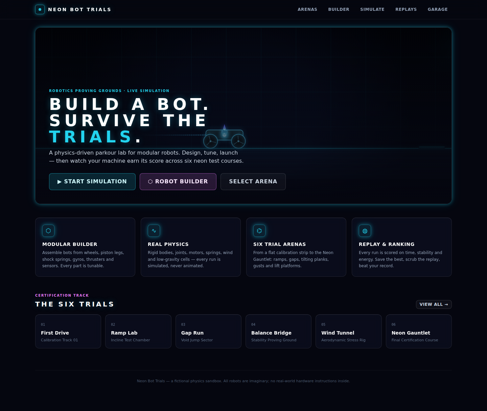
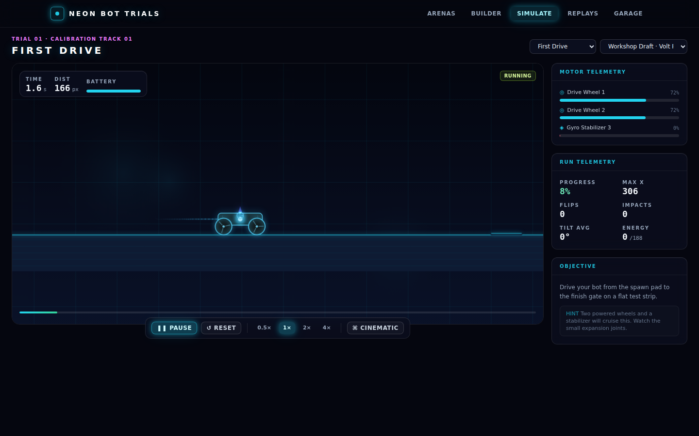
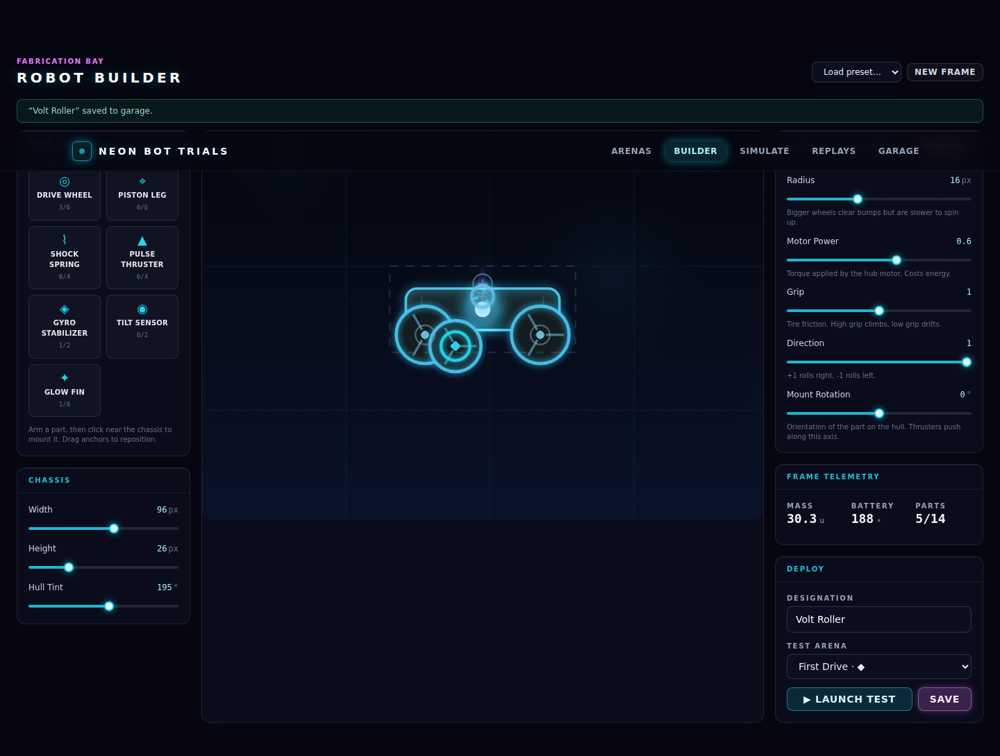
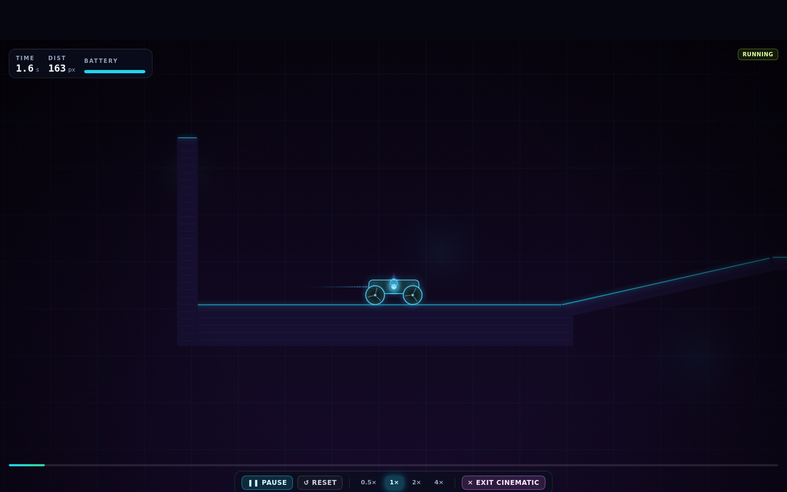

# Neon Bot Trials

A physics-based **robot parkour simulator** for the browser. Design modular robots
from tunable parts, then put them through six neon obstacle-course arenas where
every run is scored on time, stability and energy — with replays, a local
leaderboard and a cinematic camera mode.

> Neon Bot Trials is a fictional game/simulation. All robots are imaginary and
> nothing here describes real-world hardware.



| Simulation | Builder | Cinematic |
| --- | --- | --- |
|  |  |  |

## Tech stack

| Layer | Choice |
| --- | --- |
| Framework | Next.js 14 (App Router, static prerender) + React 18 + TypeScript (strict) |
| Physics | [Matter.js](https://brm.io/matter-js/) 0.20 — rigid bodies, constraints, collisions |
| Rendering | Canvas 2D with a custom neon renderer (glow, particles, trails, parallax) |
| State | Zustand (session state) + localStorage (persistence) |
| Styling | Tailwind CSS 3 |
| Unit tests | Vitest (engine runs headlessly in Node) |
| Visual QA | Playwright (desktop / tablet / mobile) |

## Quick start

```bash
cd neon-bot-trials
npm install
npm run dev        # http://localhost:4310
```

Production:

```bash
npm run build
npm run start      # serves the production build on :4310
```

## Scripts

| Command | What it does |
| --- | --- |
| `npm run dev` | Dev server on port 4310 |
| `npm run build` | Production build |
| `npm run start` | Serve the production build |
| `npm run lint` | ESLint (`next/core-web-vitals`) |
| `npm run typecheck` | `tsc --noEmit` |
| `npm test` | Vitest unit suite (52 tests incl. a headless gameplay balance sweep) |
| `npm run visual:qa` | Build + Playwright visual QA (27 checks × screenshots) + `qa/artifacts/REPORT.md` |
| `npm run visual:qa:only` | Visual QA against an existing build |

## Screens

- **/** — landing page with a *live* self-running demo simulation in the hero.
- **/arenas** — arena select: animated minimap previews, difficulty, hazard badges, your best score per arena.
- **/builder** — robot builder: click-to-mount parts, drag anchors, per-part tuning sliders, chassis shaping, save to garage, launch a test.
- **/simulate** — the arena: play/pause/reset, 0.5–4× speed, live motor telemetry, run telemetry, results modal with score breakdown, cinematic mode.
- **/replays** — leaderboard of every archived run + scrubbable replay theater.
- **/robots** — the garage: saved builds and factory presets (edit / duplicate / test / delete).
- **/qa** — runtime self-check page that executes the core systems (including a real physics run) in your browser and reports PASS/FAIL.

## Architecture

```
src/
  lib/
    types.ts      — all shared domain types (pure data, no engine objects)
    parts.ts      — the part catalog: 7 part types with tuning params & bounds
    robots.ts     — design operations (add/remove/update/validate), presets, battery/mass
    arenas.ts     — the 6 arena definitions + structural validation
    engine.ts     — SimEngine: builds a Matter.js world, runs controllers at 60 Hz,
                    tracks telemetry, records replay frames, detects finish/fail
    scoring.ts    — pure scoring model (unit-tested, shown in the results modal)
    replay.ts     — quantized replay codec (encode/decode/lerp/validate)
    storage.ts    — namespaced localStorage persistence with validation & pruning
    render.ts     — NeonRenderer: draws arenas + robots from plain data
    camera.ts     — smooth-follow camera with cinematic mode & impact shake
    preview.ts    — rest-pose frames for previews; replay thruster FX reconstruction
  components/     — canvas hooks, SimulationStage, BuilderCanvas, ReplayViewer, UI kit
  app/            — one route per screen (App Router)
  store/          — Zustand session store (auto-persists the builder draft)
tests/            — Vitest suites (robots, arenas, scoring, storage, engine, replay, balance)
qa/               — Playwright config, visual QA spec, report generator
```

Design rule: **everything that crosses a boundary is plain serializable data.**
The engine consumes `RobotDesign` + `ArenaDef` and emits frames/telemetry; the
renderer consumes frames; replays store frames. Matter.js objects never leak
into React.

## How the physics works

- One `SimEngine` per run. Fixed 60 Hz tick (`Engine.update(engine, 1000/60)`);
  the UI accumulates real time × speed multiplier and steps whole ticks.
- **Wheels** — circle bodies pinned to the chassis; hub motors steer angular
  velocity toward a target spin (converted rad/s → per-tick units) under an
  acceleration cap. Traction, slopes and slip all emerge from Matter friction.
- **Legs** — two segments pinned at hip and knee. Servo-style joint motors
  (velocity tracking + a small position hold) follow a sine gait:
  `hip = swing·sin(2πft + phase)`, knee lags by `kneeLag` with a `kneeBias`
  rest bend. A negative (bird-leg) bias extends the leg on the back-swing —
  that asymmetry is what produces forward walking.
- **Springs** — damped distance constraints to a high-friction foot pad.
- **Thrusters** — impulse burns on an interval/duty rhythm, gimballed through
  the center of mass. With a **sensor** mounted they also fire closed-loop:
  on excessive tilt (recovery) and in free-fall (auto-jump).
- **Stabilizer** — a gyro that applies corrective angular acceleration
  against chassis tilt, energy-metered.
- **Battery** — every actuator drains a battery sized by chassis area; an
  empty battery drops all motors to 35 % power ("limp mode").
- **Environments** — wind zones apply gusting accelerations to any body inside;
  low-gravity zones cancel a fraction of gravity; moving platforms are
  repositioned kinematically with velocity set for friction carry; seesaws are
  dynamic planks pinned at a pivot with pylon stops capping their tilt.

## Scoring

`computeScore(telemetry, arena)` is a pure function:

- completion: 1000 pts (or `progress × 600` on a DNF)
- time bonus (completion only): up to 500 pts scaled by remaining time
- stability bonus: up to 200 pts for low average tilt
- energy bonus: up to 150 pts for battery left over
- penalties: 40/flip (cap 200), 15/hard impact (cap 150)
- grade S/A/B/C/D from the total + completion

## Replays

The engine records `[x·10, y·10, angle·1000]` ints per dynamic body at 30 Hz
plus a thruster-firing bitmask. Replays embed the robot design, are validated
on load, interpolate between frames during playback, and are pruned
oldest-first (10 kept) to respect localStorage quotas.

## Adding a new arena

1. Append an `ArenaDef` to `ARENA_LIST` in `src/lib/arenas.ts`. Coordinates are
   center-based, y grows downward, the standard floor top is `y = 600`.
   Give it terrain, a `start`, a `finish` rect, `timeLimit`, `killY`, a theme,
   and any wind/gravity zones, moving platforms or seesaws.
2. Run `npm test` — arena validation and the **balance sweep** run automatically;
   the sweep fails if no shipped preset can complete your arena (the campaign
   must stay winnable).
3. That's it: arena select, the simulator, scoring and replays all read from
   the same definition.

## Adding a new part type

1. Add the catalog entry (label, mass, max count, tuning params) in
   `src/lib/parts.ts` and the `PartType` union in `src/lib/types.ts`.
2. Implement its runtime in `src/lib/engine.ts`: build bodies/constraints in
   `buildRobot`, register drawable bodies in `registerDynamicBodies`, and add
   its controller to `applyControllers` (update `partActivity` for the HUD).
3. Mirror the rest pose in `src/lib/preview.ts` (`staticFrameFromDesign`) —
   body ordering must match the engine exactly.
4. Draw it in `src/lib/render.ts` (a body role and/or a chassis decoration).
5. Extend `tests/robots.test.ts`.

## Visual QA

`npm run visual:qa` builds the app, launches it, and drives every screen at
1440×900, 834×1112 and 390×844. It verifies real behavior — mounting a part in
the builder, running a full trial to the results modal, opening the saved
replay, cinematic mode hiding chrome, the `/qa` self-check passing — plus
canvas-paint checks (no blank renders) and layout integrity (no horizontal
overflow), and captures 27 screenshots to `qa/artifacts/` with a summary in
`qa/artifacts/REPORT.md`.

## Deployment (Vercel)

The app lives in the `neon-bot-trials/` subdirectory of this repository.

1. Import the repo in Vercel and set **Root Directory** to `neon-bot-trials`.
2. Framework preset: **Next.js** (defaults work — `npm run build`).
3. No environment variables are required. All persistence is client-side
   localStorage; there is no backend.

Any other Node 18+ host works: `npm ci && npm run build && npm run start`.

## Known limitations

- Persistence is per-browser localStorage — no accounts or cloud sync; only the
  10 most recent runs keep full replay data (scores are always kept).
- The physics is 2D (side-view). Matter.js friction is iterative, so very steep
  slopes (>~20°) exceed wheel traction by design.
- Legged locomotion is intentionally emergent: badly tuned gaits stumble,
  moonwalk or fall over. That's the game.
- Best experienced on desktop/tablet; the mobile layout is functional but the
  builder favors a pointer.

See [docs/MAINTAINERS.md](docs/MAINTAINERS.md) for a deeper tour.
